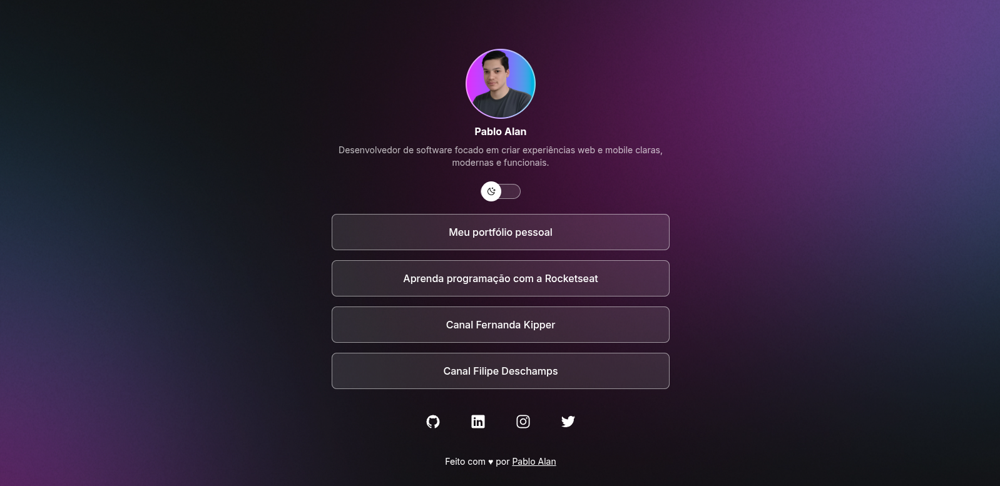
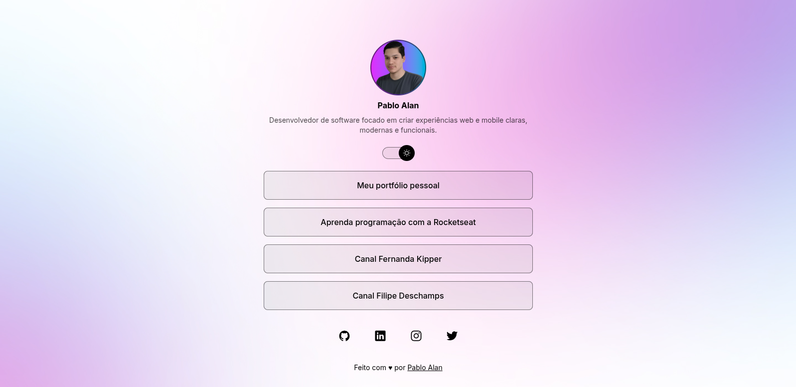

<h1 align="center">
  
</h1>

<p align="center">
  

  

  
  
  <a href="https://github.com/pabloxt14/dev-links/commits/master">
    
  </a>
    
   

   <a href="https://github.com/pabloxt14/dev-links/stargazers">
    
  </a>
</p>

<p>
  
</p>

<p align="center">
 <a href="#-about">About</a> | 
 <a href="#-deploy">Deploy</a> |
 <a href="#-layout">Layout</a> | 
 <a href="#-setup">Setup</a> | 
 <a href="#-technologies">Technologies</a> | 
 <a href="#-license">License</a>
</p>


## 💻 About

Esta aplicação de nome **DevLinks** consiste basicamente em um site responsivo agregador de links e redes sociais de contato pessoal.

Os principais conhecimentos aplicados nesta aplicação foram:
- Criação de sites completos com `Next.js`, tendo recursos como `SSR`, `SSG` e `ISR`
- Estilização utilizando `TailwindCSS` e criação de temas `dark` e `light` usando `Next Themes`
- Utilização do CMS `Prismic` para geração de conteúdo dinâmico para o site


## 🔗 Deploy

O deploy da aplicação pode ser acessada através da seguinte URL base: https://devlinks-pabloalan.vercel.app/


## 🎨 Layout

Você pode visualizar o layout do projeto através [desse link](https://www.figma.com/community/file/1550919285199284485). É necessário ter conta no [Figma](https://www.figma.com/) para acessá-lo.

A seguir, veja uma demonstração das principais telas da aplicação:

### Dark Mode

<p align="center">
  
</p>

### Light Mode

<p align="center">
  
</p>


## ⚙ Setup

### 📝 Requisites

Antes de baixar o projeto você vai precisar ter instalado na sua máquina as seguintes ferramentas:

* [Git](https://git-scm.com)
* [NodeJS](https://nodejs.org/en/)
* [NPM](https://www.npmjs.com/), [Yarn](https://yarnpkg.com/) ou [PNPM](https://pnpm.io/)

Além disto é bom ter um editor para trabalhar com o código como [VSCode](https://code.visualstudio.com/)

### Cloning and Running

Passo a passo para clonar e executar a aplicação na sua máquina:

```bash
# Clone este repositório
$ git clone git@github.com:pabloxt14/dev-links.git

# Instale as dependências
$ npm install

# Abrir painel do slicemachine do Prismic (obs: conecte-se a sua conta do Prismic e crie um repositório)
$ npm run slicemachine

# Inicie o projeto
$ npm run dev
```


## 🛠 Technologies

As seguintes principais ferramentas foram usadas na construção do projeto:

- **[Next.js](https://nextjs.org/)**
- **[React](https://react.dev/)**
- **[TypeScript](https://www.typescriptlang.org/)**
- **[TailwindCSS](https://tailwindcss.com/)**
- **[Prismic](https://prismic.io/)**
- **[React Icons](https://react-icons.github.io/react-icons)**
- **[Next Themes](https://github.com/pacocoursey/next-themes)**

> Para mais detalhes das dependências gerais da aplicação veja o arquivo [package.json](./package.json)


## 📝 License

Este projeto está sob a licença MIT. Consulte o arquivo [LICENSE](./LICENSE) para mais informações

<p align="center">
  Feito com 💜 por Pablo Alan 👋🏽 <a href="https://www.linkedin.com/in/pabloalan/" target="_blank">Entre em contato!</a>  
</p>